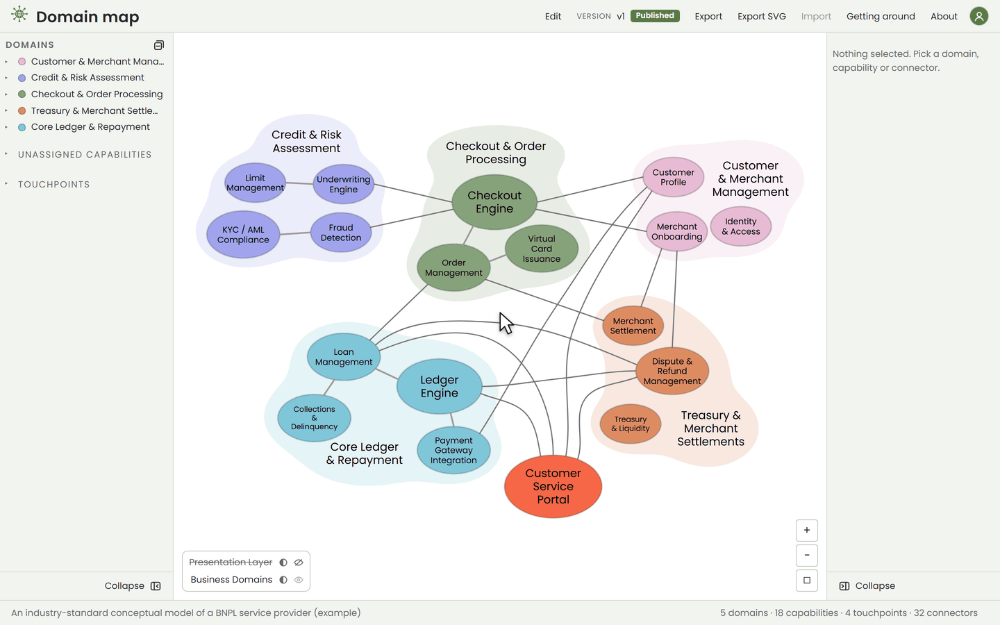

# Domain map

A shared **map** of your organization, so flow conversations start from context instead of a blank whiteboard.

The map is the fixed terrain: your domains and the business capabilities within them, each in a deliberate position. Whereas a diagram's layout is arbitrary -- rearrange it and nothing is lost -- a map anchors elements geometrically, so position carries meaning, and the terrain stays learnable across teams.

Flows are overlays. Trace a payment authorization from checkout through invoicing, financial booking, and settlement, and the route shows which teams are involved and how each participates in the end-to-end flow. Think of Google Maps as the terrain and your planned route as the overlay.

Establish the context once. Then draw on top of it -- with a marker or digitally -- every time after.



## Run it

```bash
# everything in Docker: the app, and the Postgres its versions live in
docker compose up

# or with Node, against that same Postgres
docker compose up -d postgres
npm install
npm start
```

Then open <http://localhost:8000>. The map that greets you is an example — an
industry-standard model of a BNPL service provider — for you to edit into your
own, or to replace wholesale with an [imported](#taking-it-elsewhere) one.

## Stop it

`Ctrl+C` stops the container in the foreground. From another terminal, or after `docker compose up -d`:

```bash
# remove the containers but keep the volumes: the icons, the settings and the versions
docker compose down

# remove the volumes too, and the map goes back to the example
docker compose down -v
```

## Drawing the map

The map opens read-only, so it can be handed around and pointed at without
anyone changing it by accident. **Edit** turns changes on, and while it is on
the two panels grow the buttons that make them.

**Domains and capabilities.** *Add a domain* puts a fresh one on open ground
beside the map. *Add a capability* follows the selection: into the selected
domain, beside the selected capability in the domain it already sits in, or on
open ground when nothing is picked. Name either in the **Title** field on the
right, or rename a domain in place by double-clicking its title on the map.
Each shape also carries a description and an owner, and a capability can carry
an icon.

**Arranging.** Drag a domain and everything inside it comes along. Drag a
capability to move it within its domain, onto another domain to hand it over,
onto another capability to swap the two, or onto open ground to leave it loose.
A domain's title has its own place: drag it around the blob, and while
renaming it drag the bars at either side to set the width it wraps at.

**Connectors.** Point at a capability and its connection points appear. Drag
from one to a point on another capability — or click one, then the other — and
a line joins them. Drag an end to move it, Shift-click a curved line to add a
bend, double-click a bend to take it out. A line that stays inside one domain is
drawn quietly, as internal plumbing; one that crosses a boundary is a public
event, and reads louder.

**Colour.** *Edit palette* opens the map's own 24 colours in the bottom corner,
over an overlay that leaves the map in view. Every shape wears a swatch from
it, so recolouring the palette recolours the map.

**Getting around** — the button in the header — lists every shortcut and
gesture there is: undo, bold, the size and shape steps, restacking, and the
keys that apply while renaming.

## Asking an AI about the map

**Assistant**, in the header, takes the details panel's place. Pick a skill:
*Describe* the capability you have selected, *Fill the blanks* across a domain,
*Grill the boundaries*, *Find missing connections*, *Compare with a standard*,
*Trace a flow*, or *Ask your own*.

**With a model connected**, an owner presses a skill and **Send**; *Ask your
own* opens a box for a question of your own. The answer comes back under the
button, and what it suggests as cards underneath. Only the last exchange is
shown and nothing of it is kept, though the model is reminded of the last few
turns until you **Start over** or reload. Connecting one is two environment
variables —

```bash
ASSISTANT_API_URL=http://localhost:11434/v1/chat/completions   # a local Ollama, say
ASSISTANT_API_KEY=ollama
ASSISTANT_MODEL=llama3.1
```

— and the URL can be anything that answers chat completions, free or corporate,
or Anthropic's Messages API. [docs/BRANDING.md](docs/BRANDING.md#what-it-needs-to-run)
has the rest. The key stays on the server, and the page says which host your
messages go to.

**Without one**, **Copy prompt** puts the task, the map and the format to answer
in on the clipboard; take it to the AI chat you use, and in **Edit** mode paste
the reply back and **Review reply**.

Either way the map goes out without its drawing — no positions, no colours — and
without owners' names unless you tick them in. It is the whole map, so send it
only where your organisation allows.

Every suggestion becomes a card that says what it would do and why; pressing a
name on it shows that shape on the map. **Apply**, in Edit mode, makes the change
as one Ctrl+Z. A reply can describe, rename, add, move and connect; it cannot
remove anything, so what it thinks should go arrives as a note for you to act on.

Say **what the business is** first — in the details panel, with nothing selected.
It is part of the map, it heads every prompt, and it is the difference between a
review of your business and a review of a map.

## Versions, and the one everyone sees

Versions are kept in Postgres, and one of them is **published**. That is the
one anyone who signs in sees, and the one the map opens at.

**Save** writes the version that is open. **Versions** — the chip naming the
one you are on — opens the list: open another, *Save as new* to keep the
current map as the next version, publish one, or delete one. **Cancel** unwinds
everything done since **Edit** was pressed, all at once.

Who may do any of this is one setting, `OWNER_EMAILS`: a comma-separated list
of the people who may open any version, edit, save, delete and publish.
Everyone else who signs in sees the published version and nothing else. Left
empty it names nobody in particular and everyone who signs in is an owner — the
server warns about that at startup. With sign-in off, as in `dev.env`, everyone
is an owner, which is what makes `npm start` work with no configuration at all.

## Taking it elsewhere

**Export** downloads the whole map as JSON — the file to keep in a repo, diff,
or hand to someone else. **Import** replaces the map from one of those files.
**Export SVG** downloads the diagram as a picture, for a slide or a wall.

## Make it your own

Another repo can install this as a package and supply its own branding, rather
than forking it. Scaffold one:

```bash
npx --package=github:alekseigurba/domain-map create-domain-map-app acme-domain-map --title "Acme domain map"
```

That writes a repo holding only what is yours — a ten-line server, a `brand/`
folder of token overrides and a `seed/` folder with your starting map — and
installs the app from a git tag. [docs/BRANDING.md](docs/BRANDING.md) is the
contract: which files a consumer may override, which are internal, and how the
palette follows the stylesheet.

The `Dockerfile` and `docker-compose.yml` in this repo run the example app. A
consumer repo gets its own, which installs the package instead of copying
`app/`.

## Working on domain-map itself

[docs/DEVELOPMENT.md](docs/DEVELOPMENT.md) covers the repo: how it is laid out,
how to run the tests, and how a release is cut.
