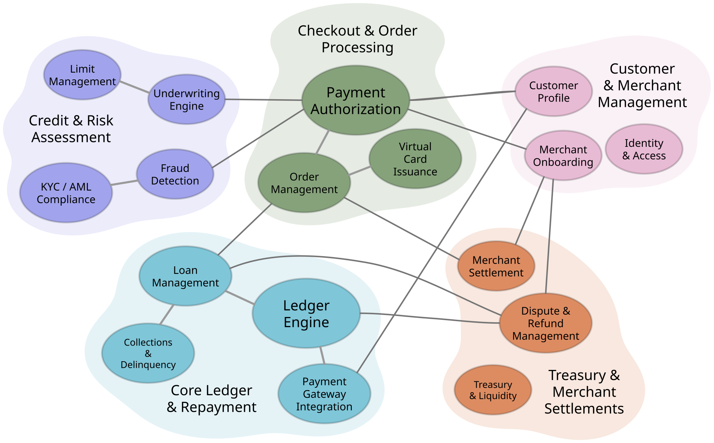

# Domain map

A shared **map** of your organization, so flow conversations start from context instead of a blank whiteboard.

The map is the fixed terrain: your domains and the business capabilities within them, each in a deliberate position. Whereas a diagram's layout is arbitrary -- rearrange it and nothing is lost -- a map anchors elements geometrically, so position carries meaning, and the terrain stays learnable across teams.



Flows are overlays. Trace a payment authorization from checkout through invoicing, financial booking, and settlement, and the route shows which teams are involved and how each participates in the end-to-end flow. Think of Google Maps as the terrain and your planned route as the overlay.

Establish the context once. Then draw on top of it -- with a marker or digitally -- every time after.

## Run it

```bash
npm start
```

Then open <http://localhost:8000>.

Or with Docker, which keeps the map, the icons and the settings in one volume:

```bash
docker compose up
```

## Stop it

`Ctrl+C` stops the container in the foreground. From another terminal, or after `docker compose up -d`:

```bash
docker compose down
```

That removes the container but keeps the `domain-map-data` volume, so the next `docker compose up` comes back to the same map, the same version history, and the same icons. Everything the app stores lives under `data/`, which is the one folder the volume is mounted on.

Adding `-v` removes the volume too:

```bash
docker compose down -v
```

That deletes every saved version and every uploaded icon. The next start finds an empty store and seeds it again from `seed/` -- which is what you want to get back to the example map, and not what you want on a map anyone has worked on.

## Use it in your own repo

Another repo can install this as a package and supply its own branding, rather than forking it. Scaffold one:

```bash
# npx needs the package named explicitly: the bin lives inside `domain-map`,
# and there is no `create-domain-map-app` package on the npm registry.
npx --package=github:alekseigurba/domain-map create-domain-map-app acme-domain-map \
  --title "Acme domain map" --color "#7b2d8e"
```

That writes a repo holding only what is yours -- a ten-line server, a `brand/` folder of token overrides and a `seed/` folder with your starting map -- and installs the app from a git tag. [BRANDING.md](BRANDING.md) is the contract: which files a consumer may override, which are internal, and how the palette follows the stylesheet.

The `Dockerfile` and `docker-compose.yml` in this repo run the example app. A consumer repo gets its own, which installs the package instead of copying `app/`.

## Shortcuts

Keyboard shortcuts and gestures are under **Getting around**, in the app's header.

## Shape defaults

What a new domain or capability looks like is set in one file, [`app/js/defaults.js`](app/js/defaults.js):

```js
export const DOMAIN_SHAPE = Object.freeze({
  title: 'New\ndomain',
  color: '#d4d1cf',
  opacity: 20,
  fontSize: 72,
  fontWeight: 'regular',
  titleScale: 1,
});

export const CAPABILITY_SHAPE = Object.freeze({
  title: 'New capability',
  color: '#86a27b',
  fontSize: 32,
  fontWeight: 'regular',
  sizeScale: 1,
  stretch: 2,
});
```

Change a value, then check the file:

```bash
node tests/defaults.test.mjs
```

With `npm start`, reload the page to pick the change up. The Docker image copies `app/` in when it is built, so rebuild it with `docker compose up --build`.

### Allowed values

| Value | Domain | Capability |
| --- | --- | --- |
| `title` | Up to 200 characters. `\n` starts a new line. | Up to 200 characters |
| `color` | A hex color, `#rgb` or `#rrggbb` | A hex color, `#rgb` or `#rrggbb` |
| `opacity` | 10 to 100, in steps of 10 | Not a setting: capabilities are always solid |
| `fontSize` | `32`, `36`, `48`, `64`, `72`, `80`, `100` | `24`, `32`, `36`, `48`, `52`, `56`, `64`, `72`, `80` |
| `fontWeight` | `regular` or `bold` | `regular` or `bold` |
| `titleScale` | `0.6`, `0.8`, `1`, `1.25`, `1.5`, `2` (the **Title size** list) | Not used |
| `sizeScale` | Not used | `1` to `3`, in steps of `0.2` (the **Shape size** list) |
| `stretch` | Not used | `-2` tall, `-1`, `0` round, `1`, `2` wide (the steps of Ctrl+< and Ctrl+>) |

Use only these values. A font size or stretch that isn't in its list still draws, but a map saved with it fails validation the next time it's opened. The test catches that. A scale that isn't in its list draws and saves, but the details panel can't show it as selected.

To offer another size, add it to the list in both [`app/js/geometry.js`](app/js/geometry.js), which the details panel reads, and [`app/js/rules.js`](app/js/rules.js), which decides what a map file may hold.

### How the color is picked

A shape stores a palette swatch, not a color. When a shape is created, its default color is looked up in the map's current palette: it gets the swatch with exactly that color, or the closest one. In the stock palette, `#86a27b` is swatch 1, and `#d4d1cf` is not in it at all, so a new domain gets the closest one, swatch 3 (`#e8bbd5`). If a map's palette has been edited and no longer has the color, the shape gets the closest swatch.

### Where the defaults apply

- **Add a domain** uses `DOMAIN_SHAPE` and places the domain beside the rest of the map.
- **Add a capability** uses `CAPABILITY_SHAPE`. Where the capability goes depends on what is selected:
  - A domain: inside that domain. In an empty domain it goes under the title, centered on it. Otherwise it goes in the first spot that is clear of the other capabilities and the title.
  - A capability: on top of it, 20 px right and 20 px down, in the same domain if it has one.
  - Nothing: on open ground beside the map.

  A capability that lands inside a domain, including one added with **Add lobe** from the domain's ⋮ menu, takes the domain's color instead of the default. This happens only when it is added, so you can change the color afterwards.
- **Reset shapes** appears at the bottom of the details panel when a domain is selected. It sets the domain's color, opacity, font size, weight and title size back to `DOMAIN_SHAPE`. It sets the color, font size, weight, shape size and stretch of every capability in the domain back to `CAPABILITY_SHAPE`. Titles, icons, positions and a dragged title width don't change.
- **Reset colors**, below it, gives every capability in the domain the domain's color.
- **Map files**: if a file leaves out a field, the field gets its default. The exception is color, which falls back to swatch 1.

Both reset buttons can be undone with Ctrl+Z. Changing a default doesn't change shapes that already exist.
